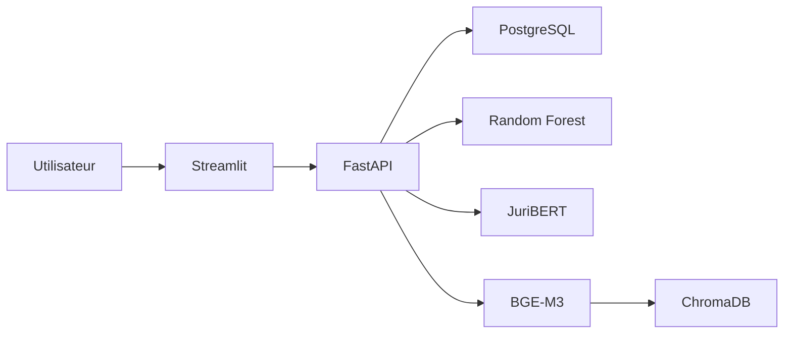

# PRUDENCIA

PRUDENCIA est une application d'aide à l'analyse de conformité des systèmes d'intelligence artificielle. Elle combine un questionnaire métier, un modèle de Machine Learning tabulaire, un modèle juridique JuriBERT et une recherche documentaire RAG.

## Architecture

| Composant | Technologie | Responsabilité |
|---|---|---|
| Interface | Streamlit | Saisie, entraînement, consultation et génération de rapports |
| API | FastAPI | Endpoints métier, orchestration et validation des requêtes |
| Machine Learning | scikit-learn | Classification à partir du questionnaire |
| Deep Learning | Transformers / JuriBERT | Classification de textes juridiques |
| RAG | BGE-M3 / ChromaDB | Indexation et recherche sémantique de documents |
| Données | PostgreSQL | Projets, analyses, questionnaires et registre des modèles |
| Exécution | Docker Compose | Assemblage des services locaux |



## Démarrage local

1. Créer `compose/dev/.env` à partir des variables décrites dans [Configuration et déploiement](docs/deploiement.md).
2. Depuis `compose/dev`, lancer `docker compose up --build`.
3. Ouvrir Streamlit sur `http://localhost:8501`.
4. Consulter l'API sur le port défini par `API_PORT` et sa documentation OpenAPI sur `/docs`.

Les modèles Hugging Face sont téléchargés au premier usage. Le premier démarrage peut donc être plus long.

## Documentation

- [Guide de documentation](docs/README.md)
- [Architecture et flux](docs/architecture.md)
- [Backend et API](docs/backend-api.md)
- [Interface Streamlit](docs/interface-streamlit.md)
- [Intelligence artificielle](docs/intelligence-artificielle.md)
- [Données et persistance](docs/donnees.md)
- [Configuration et déploiement](docs/deploiement.md)
- [Développement et tests](docs/developpement.md)
- [Référence des modules](docs/reference-modules.md)
- [Notebooks pédagogiques](notebooks/README.md)

## Organisation du dépôt

```text
compose/dev/           orchestration Docker locale
config/init/           scripts SQL d'initialisation
data/fastapi/          API, logique métier et pipelines IA
data/streamlit/        interface utilisateur
notebooks/             démonstrations ML et Deep Learning
```

## Statut

Le dépôt correspond au MVP de PRUDENCIA. Les résultats produits sont une aide à l'analyse et ne remplacent pas une validation juridique humaine.
