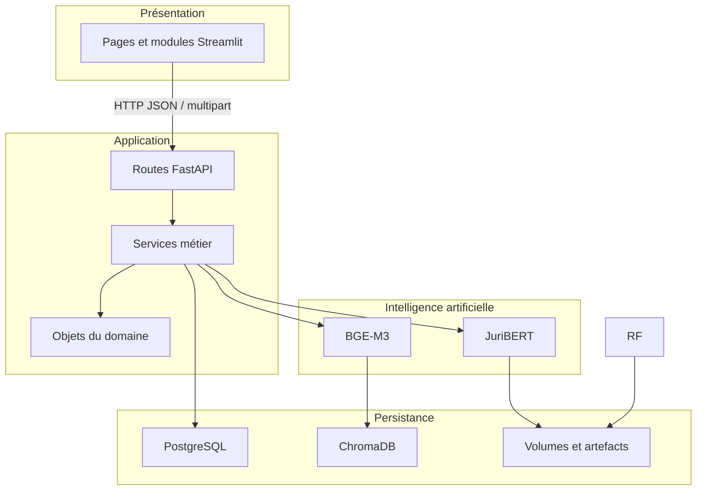

# Architecture et flux

## Vue d'ensemble

PRUDENCIA suit une architecture en couches : l'interface Streamlit consomme l'API FastAPI, les routes délèguent aux services métier, puis les services utilisent les composants IA et les systèmes de persistance.

## Flux documentaire RAG

1. L'utilisateur charge un PDF dans la page RAG ou le rapport documentaire.
2. `document_service` sauvegarde le fichier et calcule son empreinte SHA-256.
3. `pdf_service` extrait le texte avec PyMuPDF.
4. `chunking_service` découpe le texte avec un chevauchement configurable.
5. `rag_service` calcule les embeddings BGE-M3 et les stocke dans ChromaDB.
6. Une recherche transforme la question en embedding, interroge la collection et renvoie les passages les plus proches.
7. `report_builder` rassemble classification, risques, recommandations et références.

## Flux Deep Learning

1. Un CSV textuel annoté est envoyé à `/fine-tuning/train`.
2. `DatasetManager` contrôle les colonnes, les classes et la qualité des données.
3. `FineTuningTrainer` tokenise les textes et adapte JuriBERT avec Transformers.
4. `BenchmarkManager` et `ExperimentManager` enregistrent métriques et exécution.
5. Le meilleur modèle disponible est sélectionné pour `/fine-tuning/predict`.

## Frontières de responsabilité

- `api/` traduit HTTP en appels applicatifs et convertit les erreurs en réponses FastAPI.
- `services/` contient les cas d'usage réutilisables et l'orchestration métier.
- `ai/` encapsule modèles, embeddings, entraînement et accès ChromaDB.
- `domain/` définit les structures métier d'un rapport PRUDENCIA.
- `repositories/` fournit les primitives d'accès aux données.
- `data/streamlit/` ne doit pas accéder directement aux bases : il passe par l'API.

## Limites du MVP

- L'authentification et la gestion des rôles ne sont pas intégrées.
- L'entraînement est effectué dans le processus API et peut monopoliser ses ressources.
- Les dépendances ne sont pas toutes verrouillées sur une version exacte.
- Une validation juridique humaine demeure indispensable.
