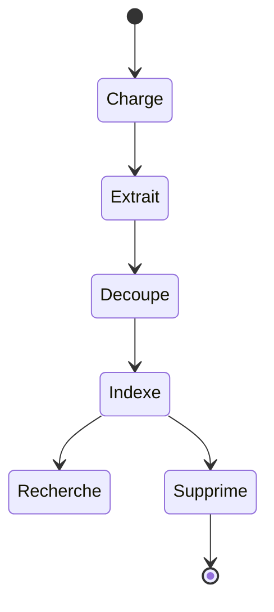

# Données et persistance

## PostgreSQL

`app/database.py` construit la connexion à partir des variables `POSTGRES_*`, initialise les structures de base et sauvegarde les analyses simples.

Le script `config/init/04_model_registry.sql` crée le schéma `prudencia` et deux tables dédiées aux modèles :

### `prudencia.trained_models`

Catalogue les modèles entraînés avec leur nom, version, tâche, modèle de base, chemin, statut, métriques et dates. Un index partiel impose au maximum un modèle actif par type de tâche.

### `prudencia.model_training_runs`

Conserve les exécutions : dataset et empreinte, colonnes, volumes, classes, hyperparamètres, métriques, durée, état, journaux et erreur éventuelle.

`BaseRepository` fournit une base commune aux accès SQL. `ModelRegistryService` et `ExperimentManager` réalisent les opérations métier plus spécialisées.

## ChromaDB

ChromaDB stocke les embeddings du RAG dans la collection `prudencia_legal_documents` par défaut. Chaque passage possède un identifiant, son texte et des métadonnées documentaires. La suppression d'un document doit supprimer tous les embeddings portant son identifiant.

Le volume `data/chromadb` rend les vecteurs persistants entre les redémarrages Docker.

## Système de fichiers

| Emplacement logique | Contenu |
|---|---|
| `/uploads` | PDF et fichiers envoyés par l'utilisateur |
| `/models` | Artefacts ML/DL montés dans l'API |
| `/models/huggingface` | Cache des modèles téléchargés |
| `data/fastapi/datasets` | Dataset de démonstration de l'API |
| `notebooks/datasets` | Datasets pédagogiques versionnés |
| `notebooks/ML/outputs` | Résultats de l'expérience Random Forest |

## Cycle de vie d'un document

L'empreinte SHA-256 permet d'identifier le contenu. Les noms transmis par le client ne doivent jamais être utilisés comme chemins sans normalisation et confinement dans le répertoire autorisé.

## Données sensibles

Les documents juridiques et réponses au questionnaire peuvent contenir des informations confidentielles. En production, prévoir chiffrement, contrôle d'accès, politique de rétention, journalisation des accès, sauvegardes et procédure d'effacement. Les datasets de démonstration ne doivent pas recevoir de données personnelles réelles.
