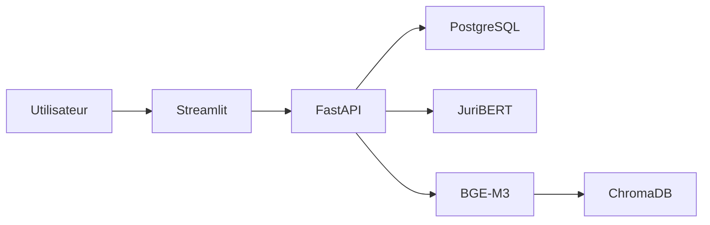

# PRUDENCIA

PRUDENCIA est une application d'aide à l'analyse documentaire de conformité des systèmes d'intelligence artificielle. Elle combine le modèle juridique JuriBERT et une recherche documentaire RAG.

## Architecture

| Composant | Technologie | Responsabilité |
|---|---|---|
| Interface | Streamlit | Saisie, entraînement, consultation et génération de rapports |
| API | FastAPI | Endpoints métier, orchestration et validation des requêtes |
| Deep Learning | Transformers / JuriBERT | Classification de textes juridiques |
| RAG | BGE-M3 / ChromaDB | Indexation et recherche sémantique de documents |
| Données | PostgreSQL | Analyses, documents et registre des modèles |
| Exécution | Docker Compose | Assemblage des services locaux |



## Démarrage local

1. Créer `compose/dev/.env` à partir des variables décrites dans [Configuration et déploiement](deploiement.md).
2. Depuis `compose/dev`, lancer `docker compose up --build`.
3. Ouvrir Streamlit sur `http://localhost:8501`.
4. Consulter l'API sur le port défini par `API_PORT` et sa documentation OpenAPI sur `/docs`.

Les modèles Hugging Face sont téléchargés au premier usage. Le premier démarrage peut donc être plus long.

## Documentation

- [Guide de documentation](DOCUMENTATION_TECHNIQUE.md)
- [Architecture et flux](architecture.md)
- [Backend et API](backend-api.md)
- [Interface Streamlit](interface-streamlit.md)
- [Intelligence artificielle](intelligence-artificielle.md)
- [Données et persistance](donnees.md)
- [Configuration et déploiement](deploiement.md)
- [Développement et tests](developpement.md)
- [Référence des modules](reference-modules.md)
- [Base de données locale](BASE_DONNEES_LOCALE.md)

### Rapports d'évolution — ordre chronologique

1. [01 — CI et qualité](01_RAPPORT_EVOLUTION_CI_QUALITE.md)
2. [02 — Gestion des erreurs API](02_RAPPORT_EVOLUTION_GESTION_ERREURS_API.md)
3. [03 — Centralisation des fichiers Markdown](03_RAPPORT_EVOLUTION_CENTRALISATION_MARKDOWN.md)
4. [04 — Traçabilité des requêtes API](04_RAPPORT_EVOLUTION_TRACABILITE_REQUETES.md)
5. [05 — Journalisation structurée](05_RAPPORT_EVOLUTION_JOURNALISATION_STRUCTUREE.md)
6. [06 — Simplification de l'image API](06_RAPPORT_EVOLUTION_SIMPLIFICATION_IMAGE_API.md)
7. [07 — Qualité du backend](07_RAPPORT_EVOLUTION_QUALITE_BACKEND.md)

## Organisation du dépôt

```text
compose/dev/           orchestration Docker locale
config/init/           scripts SQL d'initialisation
data/fastapi/          API, logique métier et pipelines IA
data/streamlit/        interface utilisateur
```

## Statut

Le dépôt correspond au MVP de PRUDENCIA. Les résultats produits sont une aide à l'analyse et ne remplacent pas une validation juridique humaine.
