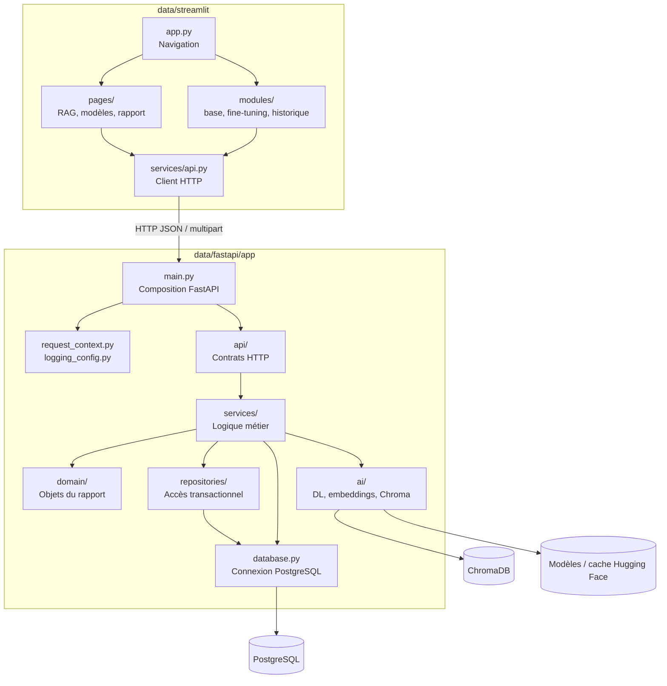
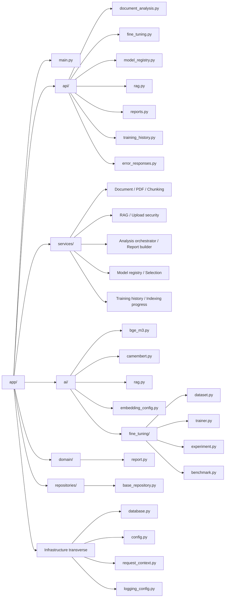
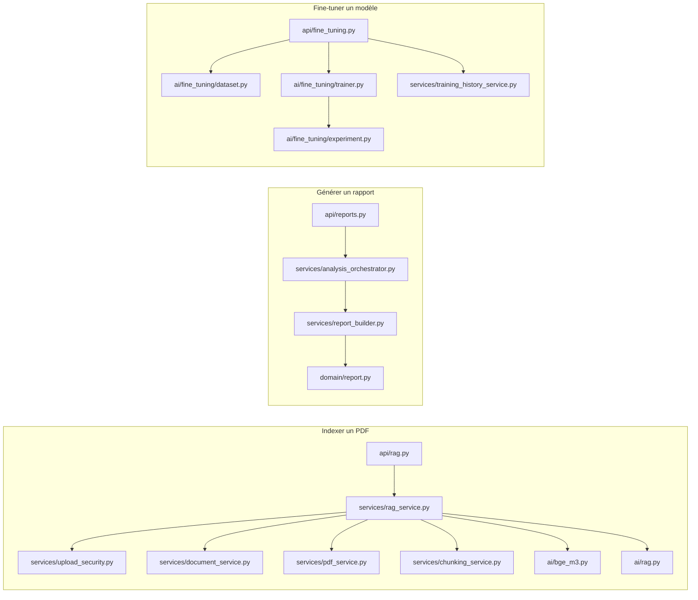
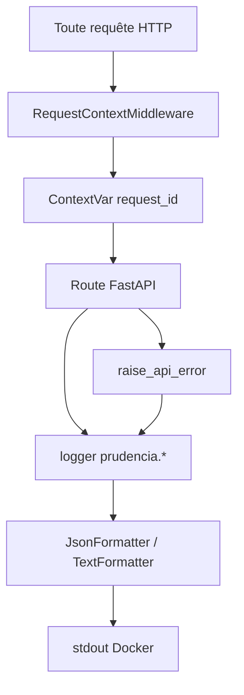

# Schéma visuel de l'architecture du code source

## Dépendances entre couches

## Arborescence fonctionnelle du backend

## Chaîne d'appel par cas d'usage

## Dépendances transverses

## Règles de dépendance recommandées

- Streamlit dépend de l'API HTTP, jamais directement de PostgreSQL ou ChromaDB.
- Les routeurs dépendent des services, mais les services ne doivent pas dépendre des routeurs.
- Les objets du domaine ne doivent pas importer FastAPI, Streamlit ou les clients de base de données.
- Les moteurs `ai/` encapsulent les bibliothèques externes et les modèles.
- La gestion des secrets et chemins reste dans la configuration et les services d'infrastructure.
- Les nouvelles requêtes SQL devraient être regroupées progressivement dans `repositories/`.
