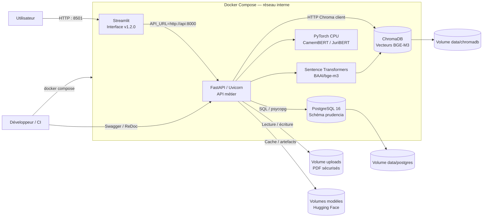
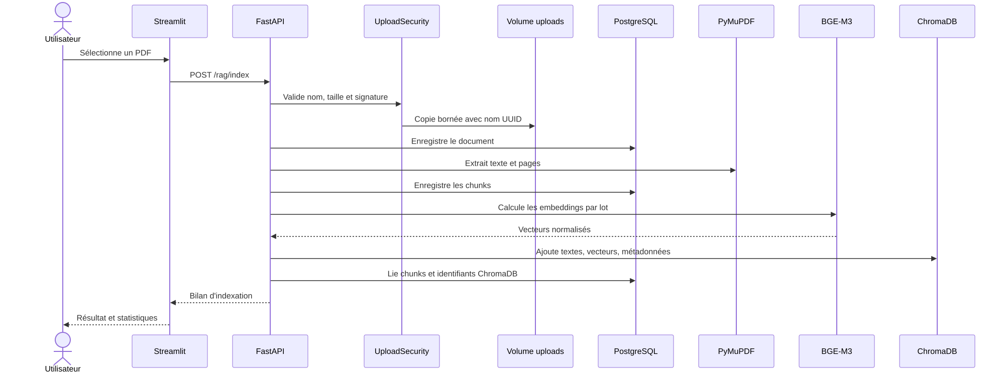
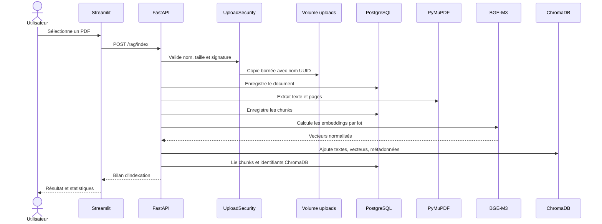
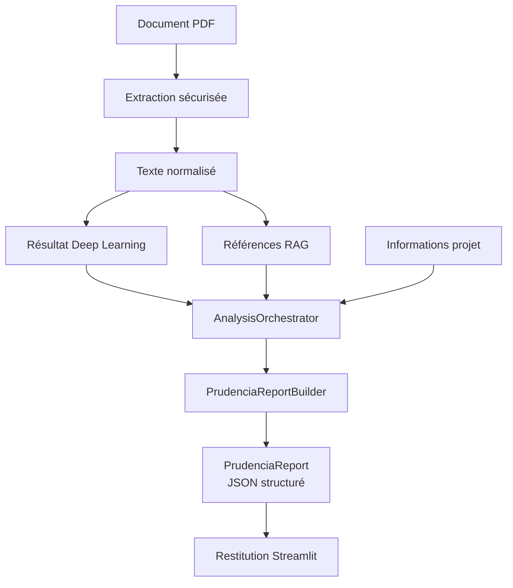
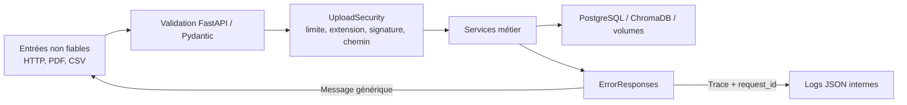

# Schéma visuel de l'architecture technique

## Architecture d'exécution

```mermaid
flowchart LR
    U["Utilisateur"] -->|"HTTP : 8501"| UI["Streamlit\nInterface v1.2.0"]

    subgraph Docker["Docker Compose — réseau interne"]
        UI -->|"API_URL=http://api:8000"| API["FastAPI / Uvicorn\nAPI métier"]
        API -->|"SQL / psycopg"| PG[("PostgreSQL 16\nSchéma prudencia")]
        API -->|"HTTP Chroma client"| CH[("ChromaDB\nVecteurs BGE-M3")]
        API --> DL["PyTorch CPU\nCamemBERT / JuriBERT"]
        API --> EMB["Sentence Transformers\nBAAI/bge-m3"]
        EMB --> CH
    end

    API -->|"Lecture / écriture"| UP[("Volume uploads\nPDF sécurisés")]
    API -->|"Cache / artefacts"| HF[("Volumes modèles\nHugging Face")]
    PG --> PGV[("Volume data/postgres")]
    CH --> CHV[("Volume data/chromadb")]

    DEV["Développeur / CI"] -->|"Swagger / ReDoc"| API
    DEV -->|"docker compose"| Docker
```

## Flux d'indexation RAG

```mermaid
sequenceDiagram
    actor User as Utilisateur
    participant UI as Streamlit
    participant API as FastAPI
    participant SEC as UploadSecurity
    participant FS as Volume uploads
    participant PG as PostgreSQL
    participant PDF as PyMuPDF
    participant EMB as BGE-M3
    participant CH as ChromaDB

    User->>UI: Sélectionne un PDF
    UI->>API: POST /rag/index
    API->>SEC: Valide nom, taille et signature
    SEC->>FS: Copie bornée avec nom UUID
    API->>PG: Enregistre le document
    API->>PDF: Extrait texte et pages
    API->>PG: Enregistre les chunks
    API->>EMB: Calcule les embeddings par lot
    EMB-->>API: Vecteurs normalisés
    API->>CH: Ajoute textes, vecteurs, métadonnées
    API->>PG: Lie chunks et identifiants ChromaDB
    API-->>UI: Bilan d'indexation
    UI-->>User: Résultat et statistiques
```

## Flux de génération d'un rapport

```mermaid
flowchart TD
    PDF["Document PDF"] --> EX["Extraction sécurisée"]
    EX --> TXT["Texte normalisé"]
    TXT --> DL["Résultat Deep Learning"]
    TXT --> RAG["Références RAG"]
    DL --> ORCH["AnalysisOrchestrator"]
    RAG --> ORCH
    PROJ["Informations projet"] --> ORCH
    ORCH --> BUILDER["PrudenciaReportBuilder"]
    BUILDER --> REPORT["PrudenciaReport\nJSON structuré"]
    REPORT --> UI["Restitution Streamlit"]
```

## Frontières de sécurité

```mermaid
flowchart LR
    EXT["Entrées non fiables\nHTTP, PDF, CSV"] --> VAL["Validation FastAPI / Pydantic"]
    VAL --> SEC["UploadSecurity\nlimite, extension, signature, chemin"]
    SEC --> CORE["Services métier"]
    CORE --> DATA["PostgreSQL / ChromaDB / volumes"]
    CORE --> ERR["ErrorResponses"]
    ERR -->|"Message générique"| EXT
    ERR -->|"Trace + request_id"| LOG["Logs JSON internes"]
```
